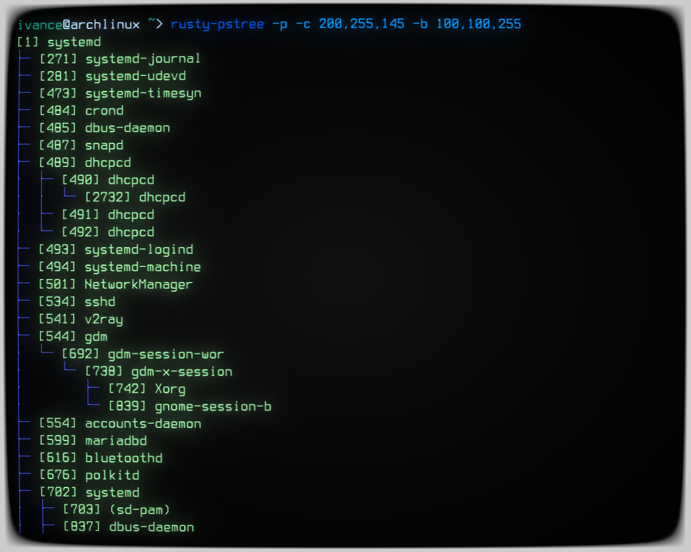

# Rusty `pstree`

### A simple pstree implemented in rust

<p align="center">
  
</p>

## Usage

```
USAGE:
    rusty-pstree [OPTIONS]

OPTIONS:
    -A, --ascii
            Use ASCII characters to draw the tree

    -b, --branch-color <BRANCH_COLOR>
            Branch color, a string in ["white", "red", "green", ...] or an RGB triple like
            "255,255,0"

    -c, --node-color <NODE_COLOR>
            node color, a string in ["white", "red", "green", ...] or an RGB triple like "255,255,0"

    -d, --depth <DEPTH>
            

    -g, --background <BACKGROUND>
            Node background color, a string in ["white", "red", "green", ...] or an RGB triple like
            "255,255,0"

    -h, --help
            Print help information

    -I, --indent <INDENT>
            Indentation size. The default value is 3

    -p, --show-pid
            Show PIDs

    -P, --padding <PADDING>
            Padding size. The default value is 1

    -r, --root-pid <ROOT_PID>
            Draw the process tree rooted on a specific PID [default: 0]

    -u, --unique
            Remove the duplicated leaf node

    -V, --version
            Print version information
```

## Build and Installation

```
git clone https://github.com/RIvance/rusty-pstree
cd rusty-pstree
cargo build --release
sudo cp target/release/rusty-pstree /usr/bin/
```
